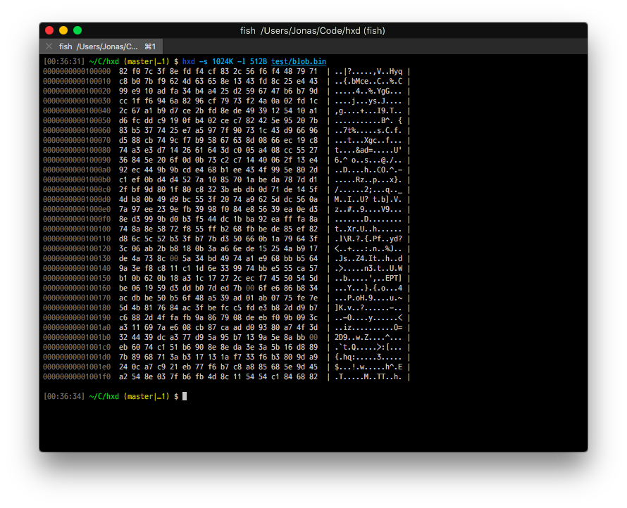

# hxd (hexdumper)
[](https://npmjs.com/package/hxd)
[](https://npmjs.com/package/hxd)

<center>



</center>

## CLI Usage

```
Usage: node hxd [options] [file]

Options

  -h, --help      Display help
  -v, --version   Display version number

  -s, --start     Start reading at the given offset
  -e, --end       Read until the given offset
  -l, --length    Read "length" bytes from start
  -b, --binary    Binary digit dump

  --color         Render output with color
  --no-color      Force-disable color output
  --prefix        Prefix output lines with a given value
```

```sh
# Hexdump a given file to stdout
$ hxd filename.bin
# Or pipe to it via stdin
$ cat filename.bin | hxd
# Start, and/or end at a given offset
$ hxd -s 512K filename.bin
# This also works with hex numbers
$ hxd -s 0x200 -e 0x400 filename.bin
# Read 1024 bytes from a given offset
$ hxd -s 0xDEAD -l 1K filename.bin
# Read the last 1024 bytes of a file
$ hxd -s -1024 filename.bin
```

## Module Usage

```js
var Hxd = require('hxd')
```

```js
var hexStream = new Hxd({
  // Deduplicate lines and print "* {lineCount}"
  dedupe: true,
  // Render line numbers (in hexadecimal)
  lineNumbers: true,
  // Render ASCII
  ascii: true,
  // Output with colors (ANSI)
  colors: false,
  // Start line offset
  offset: 0,
})

fs.createReadStream( filename )
  .pipe( hexStream )
  .pipe( process.stdout )
```
